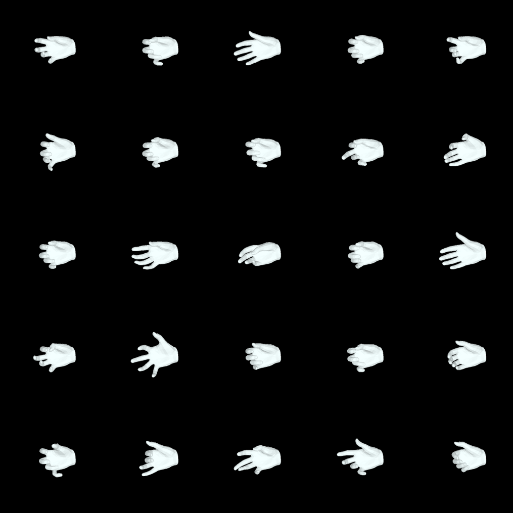
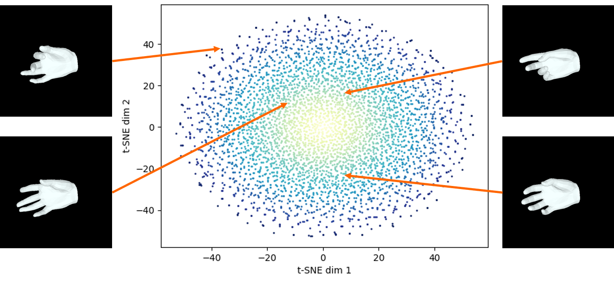

# HandPoser : Variational Hand Pose Prior


## Description
This repository includes hand(mano) version of [VPoser](https://github.com/nghorbani/human_body_prior).
Overall  

## Installation
**Requirements**
- Python 3.8
- Pytorch 1.11.0
- opencv-python
- pyrender
- chumpy
- pytorch-lightning
- dotmap

Clone this repo and run the following from the root folder:
```bash
python install -r requirements.txt
```

## Data
```
$data_repository
        |-InterHand
        |   |-annots
        |       |-train
        |       |   |-InterHand2.6M_train_MANO_NeuralAnnot.json
        |       |   |- ...                
        |       |-test
        |       |   |-InterHand2.6M_test_MANO_NeuralAnnot.json
        |       |   |- ...
        |       |-val
        |           |-InterHand2.6M_val_MANO_NeuralAnnot.json
        |           |- ...             
        |-FreiHand   
            |-training_mano.json
            |- ...
```

## Result

